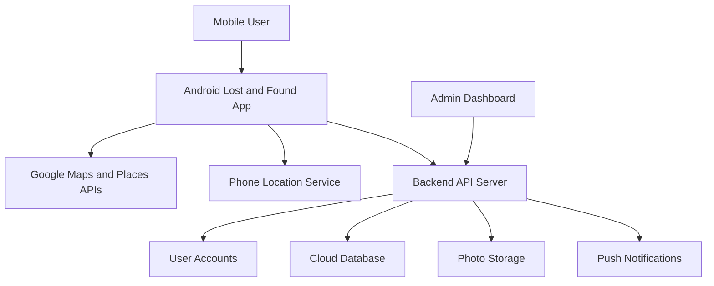

# SIT708 Task 9.1P Submission Notes

## LLM Declaration

I used ChatGPT/Codex to help me understand the Task 9.1P requirements and update my Task 7.1P Lost and Found app. The AI helped with adding Google Maps, Google Places autocomplete, current location, saving latitude and longitude in SQLite, showing adverts as map markers, radius search logic, and drafting the report and video explanation. I reviewed the code and used it in my own project.

## Research Report

This Lost and Found app can be extended into a commercial mobile app because losing personal items is a common problem in places such as universities, shopping centres, train stations, events, and workplaces. My current app is useful for a small student task because it lets a user post lost or found adverts and save them on the phone. For a real commercial app, the same idea can be improved so many users and organisations can use it together.

The main reason for extending the app is convenience. At the moment, the data is stored locally, so only one phone can see the adverts. In a commercial version, the app should use a cloud database. This would allow users to post lost and found items from different phones and see updated results straight away. Users could create accounts, add photos, choose a category, enter a description, and select the location where the item was lost or found. This would make searching easier and faster.

The map feature would be one of the most important parts of the commercial app. Users do not want to search through hundreds of posts from locations that are too far away. A radius search, such as showing items within 5 km, helps the user focus on nearby results. The app could also protect privacy by showing an approximate location instead of an exact home address. This is important because lost and found apps involve personal information like phone numbers, locations, and sometimes valuable items.

Another reason to make the app commercial is that organisations could use it to manage lost property. For example, a university security office, library, gym, or event centre could have an admin dashboard. Staff could verify found items, mark items as returned, remove fake posts, and answer user claims. This would make the system more trustworthy than a basic public notice board.

The commercial app could also include notifications. If a user reports a lost wallet near campus, the app could send a notification when someone posts a found wallet nearby. Basic matching could compare category, title, description, and location. A simple chat or claim form could also be added, but the owner should answer proof questions before collecting the item.

The app could earn money through organisation subscriptions instead of charging normal users. Universities, venues, or shopping centres could pay to use the admin dashboard and reporting tools. Normal users could still post and search for free. Overall, the commercial version would keep the simple idea of the student app but add cloud storage, accounts, privacy controls, notifications, photo storage, and admin management.

## Architecture Diagram

## Video Script

1. Show the app home screen and explain that it is the Task 7.1P Lost and Found app extended with maps.
2. Tap `Post` and show the item form.
3. Explain the item fields: type, category, title, description, name, phone, location, and image.
4. Type `Deakin Burwood Library` and tap `SEARCH TYPED LOCATION`. Explain that the app converts the typed location into latitude and longitude. If the emulator search service does not respond, the app uses a simple fallback for common demo locations.
5. Also show `CHOOSE LOCATION FROM GOOGLE` if autocomplete is working, or explain it is the autocomplete option.
6. Tap `GET CURRENT LOCATION` and explain that it uses the phone/emulator location.
7. Save a lost item and a found item.
8. Tap `Show on Map` and explain that each advert becomes a map marker.
9. Enter a radius like `5`, tap `GET CURRENT LOCATION`, then tap `Show on Map` again.
10. In the code, explain `showPostDialog`, `validateAndSave`, `searchTypedLocation`, `useSimpleLocationFallback`, `getCurrentLocation`, `openPlaceSearch`, and `showAdvertsOnMap`.

## Links To Fill In

GitHub repository link:

YouTube video link:

LLM conversation link:
